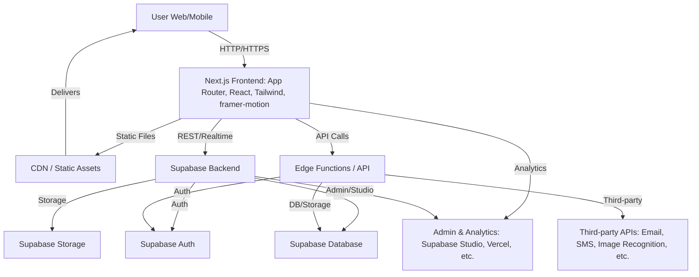

# Pooch Pet Finder


<!--  -->

---

## 🐾 Pooch Pet Finder

Pooch Pet Finder is a modern, full-stack web application designed to help reunite lost pets with their families. By connecting pet owners, volunteers, and animal shelters, the platform streamlines the process of reporting, searching, and managing lost and found pets. Built with a focus on accessibility, ease of use, and community engagement.

---

## ✨ Features

- 🔐 **User Authentication** — Secure sign up, login, and profile management
- 🐶 **Report Lost or Found Pets** — Add details, upload photos, and track status
- 🚨 **Emergency & Volunteer Requests** — Request help or offer to volunteer
- 🏠 **Shelter Dashboard** — Manage pets and shelter information
- 📊 **Dynamic Dashboard** — Animated stats, recent activity feed, and notifications
- 🤖 **Hybrid AI Pet Matching** — Combines AWS Rekognition and Google Gemini image understanding for the most accurate lost/found pet matches
- 💬 **AI Help Center** — Ask any question about POOCH Pet Finder and get instant, context-aware answers from our advanced AI
- 📱 **Responsive UI** — Mobile-friendly, accessible, and modern design

---

## 🤖 AI & Image Recognition

POOCH Pet Finder uses a hybrid AI approach for pet matching:

- **AWS Rekognition**: Detects faces and visual features in pet photos, providing robust image similarity and label-based matching.
- **Google Gemini**: Analyzes pet images to generate detailed descriptions and tags, enhancing match accuracy with generative AI.
- **Hybrid Scoring**: The system blends both AI results for the most reliable, explainable matches.

### AI Help Center
- The Help Center's AI assistant is always up to date with the app's features, mission, and FAQ. It can answer any question about POOCH Pet Finder, using a combination of app documentation, FAQ, and blog content for context.

---

## 🛠️ Tech Stack

- **Next.js** (App Router, React)
- **Supabase** (Database, Auth, Storage)
- **Tailwind CSS** (Styling)
- **framer-motion** (Animations)
- **MagicUI** (UI effects)
- **Lucide Icons**

---

## 🏗️ Architecture

### Full System Overview



#### Explanation
- **User**: Interacts via browser or mobile device.
- **Next.js Frontend**: Handles UI, routing, and client logic. Fetches data from Supabase and Edge Functions.
- **CDN/Static Assets**: Delivers images, JS, CSS, and static files for fast global access.
- **Supabase Backend**: Provides authentication, database, and storage services.
- **Edge Functions/API**: Handles server-side logic, integrations, and custom endpoints.
- **Third-party APIs**: Used for email, SMS, image recognition, and other integrations.
- **Admin & Analytics**: Monitoring, analytics, and admin tools (Supabase Studio, Vercel dashboard, etc.).

---

## 🚀 Getting Started

### Prerequisites
- Node.js (v18+ recommended)
- npm or yarn

### Setup
1. **Clone the repository:**
   ```sh
   git clone https://github.com/bantoinese83/pooch-pet-finder.git
   cd pooch-pet-finder
   ```
2. **Install dependencies:**
   ```sh
   npm install
   # or
   yarn install
   ```
3. **Configure environment variables:**
   - Copy `.env.example` to `.env.local` and fill in your Supabase credentials and other secrets.
4. **Run the development server:**
   ```sh
   npm run dev
   # or
   yarn dev
   ```
5. **Open [http://localhost:3000](http://localhost:3000) in your browser.**

---

## 💡 Usage
- Sign up or log in to your account
- Report a lost or found pet with details and images
- View and manage your reports from the dashboard
- Respond to emergency or volunteer requests
- Shelters can manage pets and update their information
- Use the Help Center to ask any question about the app and get instant AI-powered answers

---

## 🤝 Contributing

Contributions are welcome! Please follow these steps:

1. Fork the repository and create your feature branch:
   ```sh
   git checkout -b feature/YourFeature
   ```
2. Commit your changes and push to your fork:
   ```sh
   git add .
   git commit -m "Add YourFeature"
   git push origin feature/YourFeature
   ```
3. Open a pull request with a clear description of your changes.

---

## 📬 Contact

For questions, suggestions, or support, please open an issue or contact [bantoinese83](https://github.com/bantoinese83).

---

## 📝 License

This project is licensed under the MIT License.

---

*Made with ❤️ for pets, their people, and the community.* 