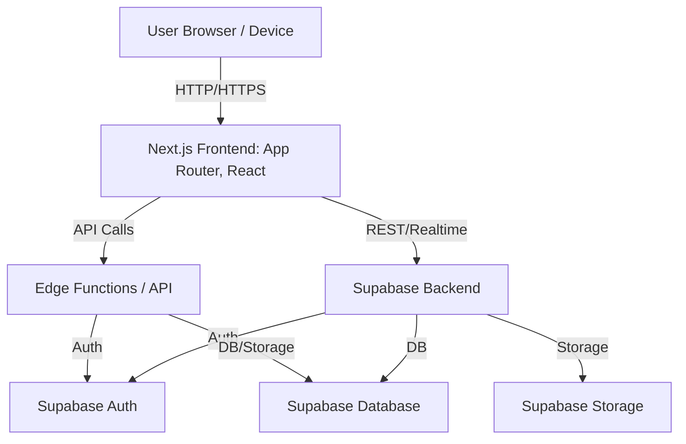

# Pooch Pet Finder


<!--  -->

---

## 🐾 Pooch Pet Finder

Pooch Pet Finder is a modern, full-stack web application designed to help reunite lost pets with their families. By connecting pet owners, volunteers, and animal shelters, the platform streamlines the process of reporting, searching, and managing lost and found pets. Built with a focus on accessibility, ease of use, and community engagement.

---

## ✨ Features

- 🔐 **User Authentication** — Secure sign up, login, and profile management
- 🐶 **Report Lost or Found Pets** — Add details, upload photos, and track status
- 🚨 **Emergency & Volunteer Requests** — Request help or offer to volunteer
- 🏠 **Shelter Dashboard** — Manage pets and shelter information
- 📊 **Dynamic Dashboard** — Animated stats, recent activity feed, and notifications
- 📱 **Responsive UI** — Mobile-friendly, accessible, and modern design

---

## 🛠️ Tech Stack

- **Next.js** (App Router, React)
- **Supabase** (Database, Auth, Storage)
- **Tailwind CSS** (Styling)
- **framer-motion** (Animations)
- **MagicUI** (UI effects)
- **Lucide Icons**

---

## 🏗️ Architecture

### System Overview



---

## 🚀 Getting Started

### Prerequisites
- Node.js (v18+ recommended)
- npm or yarn

### Setup
1. **Clone the repository:**
   ```sh
   git clone https://github.com/bantoinese83/pooch-pet-finder.git
   cd pooch-pet-finder
   ```
2. **Install dependencies:**
   ```sh
   npm install
   # or
   yarn install
   ```
3. **Configure environment variables:**
   - Copy `.env.example` to `.env.local` and fill in your Supabase credentials and other secrets.
4. **Run the development server:**
   ```sh
   npm run dev
   # or
   yarn dev
   ```
5. **Open [http://localhost:3000](http://localhost:3000) in your browser.**

---

## 💡 Usage
- Sign up or log in to your account
- Report a lost or found pet with details and images
- View and manage your reports from the dashboard
- Respond to emergency or volunteer requests
- Shelters can manage pets and update their information

---

## 🤝 Contributing

Contributions are welcome! Please follow these steps:

1. Fork the repository and create your feature branch:
   ```sh
   git checkout -b feature/YourFeature
   ```
2. Commit your changes and push to your fork:
   ```sh
   git add .
   git commit -m "Add YourFeature"
   git push origin feature/YourFeature
   ```
3. Open a pull request with a clear description of your changes.

---

## 📬 Contact

For questions, suggestions, or support, please open an issue or contact [bantoinese83](https://github.com/bantoinese83).

---

## 📝 License

This project is licensed under the MIT License.

---

*Made with ❤️ for pets, their people, and the community.* 